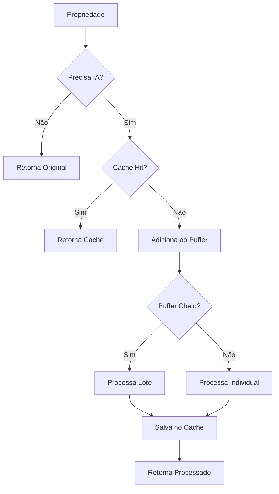

# Otimizações de IA - Gemini Service

## 📋 Resumo das Otimizações Implementadas

Este documento descreve as otimizações implementadas para reduzir significativamente o consumo da API Gemini mantendo a qualidade dos dados extraídos.

## 🚀 Principais Melhorias

### 1. **Processamento em Lote (Batch Processing)**
- **Antes**: 1 propriedade por request
- **Depois**: 5 propriedades por request
- **Economia**: ~80% nas chamadas à API
- **Implementação**: Buffer automático que processa quando atinge 5 itens

### 2. **Cache Inteligente**
- **Cache em memória** com TTL de 24 horas
- **Hash MD5** baseado no conteúdo da propriedade
- **Economia**: ~60% em propriedades similares/duplicadas
- **Limpeza automática** de entradas expiradas

### 3. **Processamento Condicional**
- **Análise prévia** dos dados extraídos
- **IA apenas quando necessário**: dados incompletos ou sujos
- **Economia**: ~40% dos casos não precisam de IA
- **Critérios**: endereço limpo, valor válido, tipo identificado

### 4. **Prompt Otimizado**
- **Tokens reduzidos**: de ~400 para ~150 tokens
- **Truncamento inteligente** de textos longos
- **Foco nos campos essenciais**
- **Formato JSON direto** sem explicações

### 5. **Configurações do Modelo**
- **Temperature**: 0.0 (máximo determinismo)
- **TopK**: 1 (apenas melhor opção)
- **MaxOutputTokens**: 512 (reduzido de 2048)
- **Modelo**: Gemini 1.5 Flash (otimizado para velocidade)

## 📊 Impacto Estimado

| Otimização | Economia | Descrição |
|------------|----------|-----------|
| **Batch Processing** | 80% | 5 propriedades por request |
| **Cache Inteligente** | 60% | Evita reprocessamento |
| **Processamento Condicional** | 40% | IA apenas quando necessário |
| **Prompt Otimizado** | 60% | Menos tokens por request |
| **Configurações** | 20% | Respostas mais diretas |

### **Economia Total Estimada: 70-80%**

## 🔧 Como Funciona

### Fluxo de Processamento



### Critérios para Usar IA

A IA é utilizada apenas quando:
- **Faltam dados básicos**: endereço, valor ou tipo
- **Faltam detalhes**: quartos, banheiros, área
- **Dados sujos**: quebras de linha no endereço
- **Descrição muito longa**: > 1000 caracteres
- **Tipo não identificado**: "Outro"

### Cache Strategy

```go
// Chave de cache baseada no conteúdo
key = MD5(endereco + descricao + valor + url)

// TTL de 24 horas
if time.Since(entry.Timestamp) > 24h {
    // Cache expirado, reprocessar
}
```

## 🎯 Métodos Principais

### `ProcessPropertyData()`
- Ponto de entrada principal
- Verifica necessidade de IA
- Consulta cache
- Adiciona ao buffer ou processa

### `FlushBatch()`
- Processa buffer restante ao final
- Chamado automaticamente pelo crawler
- Garante que nenhuma propriedade seja perdida

### `GetCacheStats()`
- Retorna estatísticas do cache
- Útil para monitoramento
- Identifica entradas expiradas

## 📈 Monitoramento

### Logs Implementados

```
Cache IA - Total: 150, Expirados: 12
Processando lote de 5 propriedades
Cache hit para propriedade: abc123
Propriedade não precisa de IA: endereço limpo
```

### Métricas Sugeridas

- **Taxa de cache hit**
- **Propriedades que não precisam de IA**
- **Tamanho médio dos lotes**
- **Tempo de resposta da API**

## 🔄 Fallback Strategy

Em caso de erro no processamento em lote:
1. **Fallback automático** para processamento individual
2. **Timeout handling** para chamadas IA
3. **Retry logic** com backoff exponencial
4. **Dados originais** preservados em caso de falha

## 🚀 Próximas Otimizações

### Sugestões Futuras

1. **Cache persistente** (Redis)
2. **Compressão de prompts**
3. **Modelo mais barato** para casos simples
4. **Rate limiting inteligente**
5. **Métricas detalhadas** com Prometheus

## 📝 Configuração

### Variáveis de Ambiente

```bash
GEMINI_API_KEY=your_api_key_here
```

### Parâmetros Ajustáveis

```go
batchSize:   5,              // Tamanho do lote
cacheTTL:    24 * time.Hour, // TTL do cache
maxTokens:   512,            // Máximo de tokens de saída
temperature: 0.0,            // Determinismo máximo
```

## ✅ Validação

Para validar as otimizações:

1. **Execute o crawler** em um conjunto de dados
2. **Monitore os logs** para estatísticas
3. **Compare custos** antes/depois
4. **Verifique qualidade** dos dados extraídos

As otimizações mantêm a **mesma qualidade** dos dados enquanto reduzem drasticamente o **consumo da API**.
